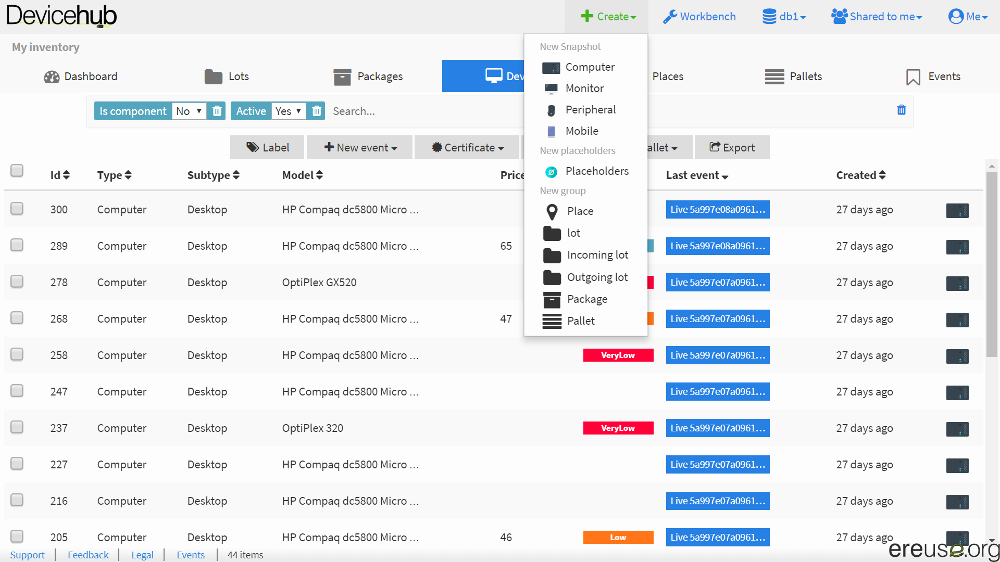
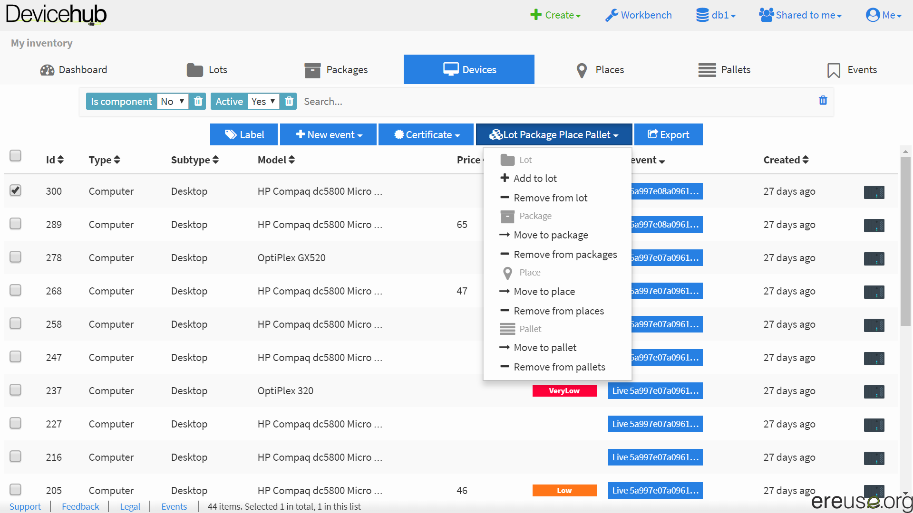

# Agrupar dispositivos

## Grupos actuales

* Place: La ubicación de un dispositivo o otro grupo.
* Lot: Es el grupo principal y el más flexible. Un dispositivo puede estar en varios lotes. Un lote puede tener varios lotes como hijos. Un lote hijo puede estar en varios lotes padres.
  * Incoming lot: Marca un lote recibido de un donante.
  * Outcoming lot: Marca un lote para transferir a un receptor
* Package: Agrupa dispositivo durante el transporte de un sitio a otro.
* Pallet: Agrupa los dispositivos de un paleta física. Un dispositivo puede estar solamente en un pallet. Un pallet no puede tener pallets hijos ni padres. Un pallet puede estar en varios lotes.

## Crear un grupo

Para crear un nuevo grupo, haz click al boton Create en la barra de arriba y escoge el tipo de grupo.

## Añadir o quitar dispositivos a un grupo

Para añadir o quitar dispositivos de un grupo. Escoge los dispositivos, haz click al boton de Lot/Package/Place/Pallet y escoge la opción adecuada.

