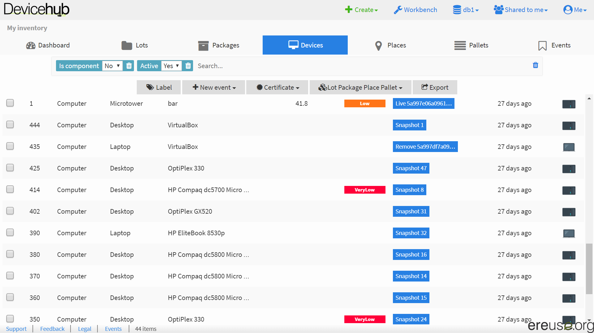

# Ver y cambiar el estado de un dispositivo

## Ver el estado

El estado de un dispositivo es el ultimo evento registrado para este dispositivo. El ultimo evento se puede ver en la columna _Last event_.

## Cambiar el estado

Para cambiar el estado de un dispositivo, es decir para crear nuevo evento, dirigese a \_New event \_y escoja el evento appropriado.

Existen los siguientes eventos:

| Evento | Criado automáticamente o por usuario |
| :--- | :--- |
| Snapshot | Subir snapshot criado con Workbench |
| Register | Criado automáticamente cuándo se registra un dispositivo por la primera vez, es decir cuando se sube un snapshot del dispositivo la primera vez |
| To prepare | Indicar que el dispositivo necesita ser preparado para la reutilización |
| To repair | Indicar que el dispositivo necesita reparación |
| Repair | Indicar que el dispositivo ha sido arreglado con exito |
| Ready | Indicar que el dispositivo esta preparado para la reutilización, es decir que esta listo para ser distribuido a un usuario |
| Locate | Actualizar la ubicación |
| Allocate | Actualizar el proprietario |
| Receive | Indicar que la recepción de un dispositivo |
| Sell | Indicar la venta de un dispositivo |
| Reserve | Reservar un dispositivo |
| Live | Criado automáticamente, indica que el dispositivo sigue en uso |
| To dispose | Indicar que hay que llevar el dispositivo a un punto de reciclaje |
| Dispose | Indicar que el dispositivo ha sido llevado a un punto de reciclaje |

