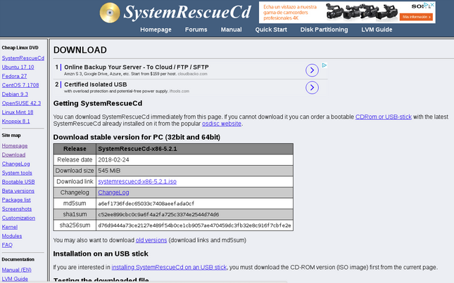
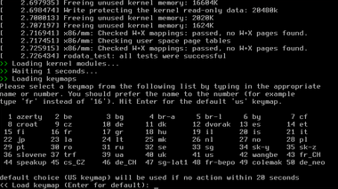

# Guia creación imagenes FSA

## ¿Qué es un archivo FSA?

Un archivo FSA contiene una copia de un Linux que copiamos y pegamos en cada computadora.

Son sistemas operativos linux listos para usarse, lo que significa que casi no los tocamos, excepto configurar un usuario predeterminado, cuyo nombre de usuario es ereuse y contraseña ; configurando el idioma y la zona horaria; e instalar la aplicación de escritorio eReuse.org .

## Creación de la maquina virtual.

1. Abrimos el VirtualBox.

 2. Descargamos la iso de la distribución de linux que queremos. Una vez tenemos la iso, vamos al virtualbox y le damos a new, y creamos una maquina linux.

 3. Ponemos un nombre para la maquina, que tipo de sistema es y la versión del sistema.

 4. Especificamos la memoria RAM que le queramos dar. 

 5. Damos a crear disco duro virtual. 

 6.Escogemos el tipo de archivo **VDI**

 7. Escogemos la opción de reservar dinámicamente.

 8. Asignamos un tamaño de disco.

 9. Ya tenemos la maquina Linux creada, ahora encendemos la maquina.

**Instalación del sistema operativo.**

1. Una vez tenemos la maquina creada damos doble click encima de la maquina.

   

2. Nos preguntara que le demos una imagen iso.

 3. Seleccionamos la iso que queramos instalar.

4. En la parte de poner el nombre y la contraseña del sistema pondremos:

\(Opcional\)Nombre de **usuario:** devicetag **Contraseña:** ereuse 

5. Una vez la instalación haya finalizado, actualizamos la maquina.

**Crear las fsa**

1. Para crear las fsa usaremos el programa [System Rescue](https://sourceforge.net/projects/systemrescuecd/files/sysresccd-x86/5.2.1/systemrescuecd-x86-5.2.1.iso/download).

 2. Una vez tenemos la iso del programa, abrimos virtualbox. 

3. En virtualbox vamos a configuraciones de la maquina y a al apartado de almacenamiento. 

4. En la parte del cd, escogemos la iso de System Rescue.

 5. Después creamos una disco duro nuevo para guardar las fsa.

 6. Una vez tenemos todo montado vamos a proceder a encender la maquina.

 7. Cuando encendemos la maquina nos aparecerá un menú, en el que seleccionaremos la primera opción.

 8. Una vez seleccionada la opción, nos empezara a cargar el programa. 

9. En un momento de la carga del software, nos pedirá la configuración del teclado, si lo queremos en español, en ingles. Para poder seleccionar el español pondremos el 13.

 10. Una vez seccionado el teclado, nos cargara un terminal. En ese terminal pondremos el siguiente comando: fdisk -l\(Nos permite visualizar los discos que tenemos en el sistema\)

 11. Cremaos la carpeta usb a /media/

 12. Una vez tenemos la carpeta creada, montamos el disco duro que hemos creado para las fsa a la carpeta usb.

 13. Ahora tocaría crear la fsa, para eso pondremos el comando: fsarchiver savefs -z 9 -j 2\(opcional\) /media/usb/nombredelaFSA.fsa /dev/sda1

 Este proceso suele ser bastante lento. 14. Cuando el programa ha acabado de hacer la fsa nos saldrá lo siguiente.

 15. Antes de reiniciar la maquina hay que desmontar el disco duro de fsa, para eso pondremos:

 16. Una vez hemos desmontado el disco duro, reiniciamos la maquina con reboot 

17. Una vez hemos reiniciado la maquina nos volverá aparecer el menú de antes para iniciar el sistema operativo podemos hacer dos cosas:

Quitar el cd o escoger la opción de **boot form first hard disk** 

18. Una vez dentro del sistema operativo, montamos el disco duro de fsa. 

19.Para monatr el disco vamos al programa discos.

20.Una vez dentro del programa discos, buscamos el disco donde hemos guardado la fsa.

21.Selecionamos el disco y le damos al boton de montar disco.

22.Una vez lo tenemos montado, vamos al disco duro y pasamos la fsa a un usb.

