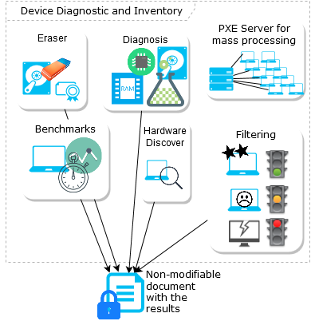

# ​Introducción Workbench, BOX y Devicehub

### Workbench

eReuse.org Workbench es un software para ayudar en el diagnóstico y el inventario de dispositivos digitales \(ordenadores de escritorio, ordenadores portátil, netbook y servidor\). Con su inicio autoarrancable, simplemente inicie su dispositivo a través de la red con el servidor PXE y pruebe y compare el hardware de su sistema, capture las características para la calificación y el número de serie para la trazabilidad y la generación de informes.

[**Más información aquí**](https://www.ereuse.org/software/)

Si ejecutamos el Workbench en un ordenador, nos registrara los componentes que tiene, numero de modelo y de serie de los componentes, la vida del disco duro, también podemos hacer test de estrés para poder comprobar cuanto puede aguantar el ordenador funcionando.

Todos estos procesos son configurables, podemos añadir o quitar procesos.

Todos estos datos se guardan en una base de datos online, nosotros si queremos ver los ordenadores que hemos registrado podemos visualizarlos mediante la página web [https://www.devicetag.io/app/login](https://www.devicetag.io/app/login)

Donde tendremos que introducir nuestro correo y la contraseña.

[**Opciones del Workbench**](instalacion-y-configuracion/opciones-del-workbench.md)

### **BOX**

La Box es un mini pc Intel Nuc modelo NUC6CAYH, con un procesador Intel Celeron J3455 de 1,50 Ghz con 8 gigas de ram, con conexión a wifi, 2 puertos usb 2.0, 4 puertos usb 3.0, 1 puerto HDMI, 1 puerto VGA, 1 puerto ethernet lan, voltaje de salida de adaptador ac: 12-19 y combo de salida de auriculares / micrófono.

La Box lleva un sistema operativo linux, con el programa Workbench server ya listo para usarse. En el escritorio de la box nos encontraremos un acceso directo a el devicetag.io donde podremos configurar a nuestro gusto el Workbench.

### Devicehub

//Intro devicehub, inventario para gestionar los dispositivos

### **eReuse.org App \(Android\)**

La función de la aplicación móvil es la de guardar, modificar o eliminar la información de los dispositivos que hayan pasado el Workbench.

[¿Como usar la aplicación móvil?](registrar-dispositivos-con-workbench/configuracion-ereuse.org-app.md)

[Tutorial DeviceTag.io Box with eReuse.org Workbench  
  
](https://vimeo.com/250253019)

