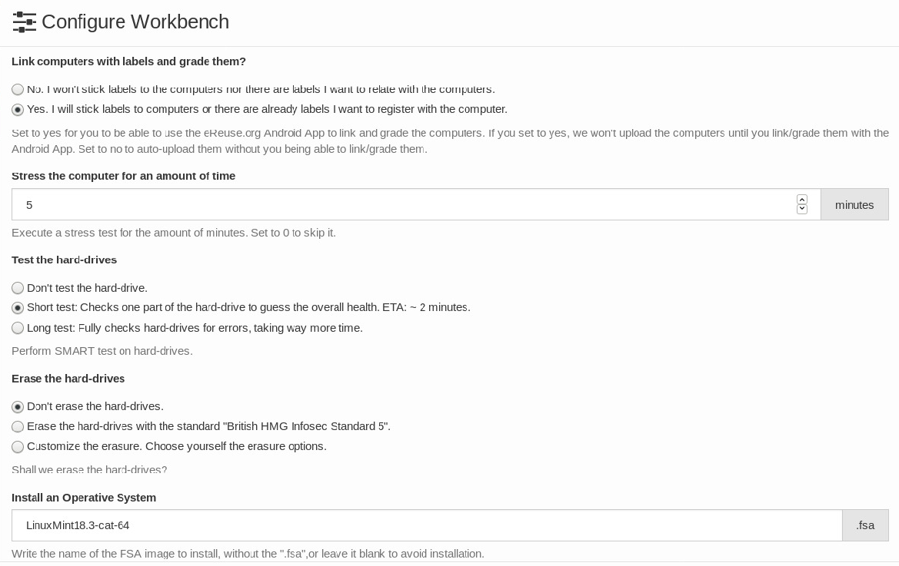

# Configuración del Workbench Server

### Configuración del Workbench Server

En el apartado **Configure Workbench** dispondremos de todas las opciones de configuración.    

Una vez dentro encontraremos las siguientes opciones:

* Linkear los ordenadores y su estado.
* Podremos elegir si queremos o no usar la aplicación móvil de eReuse para subir el dispositivo con toda la información, o no.
* Test de estrés.
* Podremos elegir el tiempo de duración del test de estrés, siendo **5 min lo recomendado** para poder testear bien todos los componentes importantes como la CPU.
* Testeo del HHD.
* Elegiremos si queremos o no que se testee el disco duro. Podremos optar por no hacer el test, que solo lo haga en una parte para comprobar su estado o que lo analice a fondo.
* Pasos de Borrado.
* Escogeremos cuantos pases de borrado queremos. Con 1 es suficiente pero con 2 aseguramos una mejor limpieza.
* Instalar el S.O. Ponemos el nombre sin Los ficheros que debemos tocar son los siguientes: la carpeta images para meter las imágenes .fsa que queremos instalar. [¿Que es una FSA?](../instalacion-y-configuracion/configuracion-avanzada/guia-creacion-imagenes-fsa.md) En este apartado elegiremos el sistema operativo que queramos instalar. Dichos sistemas operativos deberán estar en .fsa y cuando lo escojamos **ES IMPORTANTE BORRAR EL .FSA DEL NOMBRE** para que funcione como muestra la imagen anterior.

