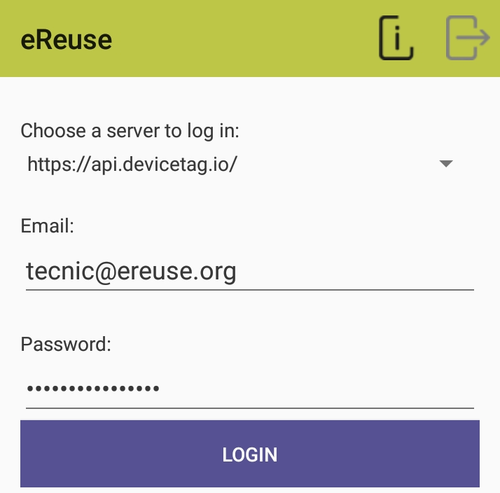
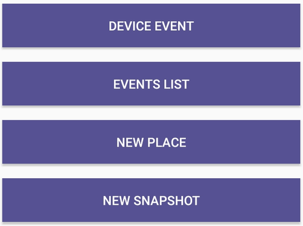
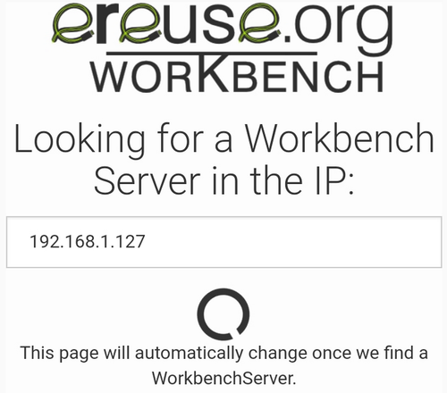

# Configuración de la App Android

_**La aplicación para móvil es de vital importancia para poder trabajar con el workbench ya que nos ofrecerá múltiples opciones la cual se adaptarán a las diferentes situaciones que nos encontremos.**_

Cada cliente tendrá su correo y contraseña para poder trabajar con su contenido sin interferencia de otros, por lo cual a la hora de ir a usar la aplicación tendremos que usar dicha información. 

Una vez logrados veremos múltiples opciones.

Escogemos las la opción **New Snapshot** y en la siguiente pantalla **Snapshot from workbench**. 

Una vez entramos a la opción deberemos poner la IP del _Workbench_

 Y una vez puesta nos saldrá la lista de maquinas que estarán pasando el proceso.

