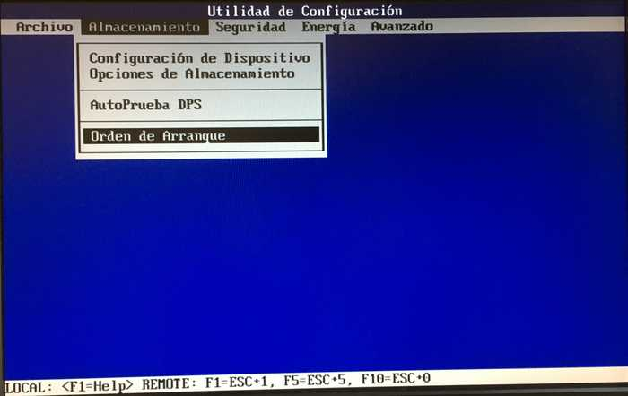

# Configurar la BIOS para arrancar por red

### Procedimiento

**Este paso es el inicio del procedimiento para poder registrar las maquinas, lo primero es configurar la bios, si no el pc no detectara el Workbench y no avanzaran de este punto.**

* Como sabéis las bios no siempre son iguales, pero siempre está la opción de cambiar el orden de arranque.

### Los procedimientos que debemos de hacer son:

1.Entrar en la bios, con la tecla que nos aparezca en la primera pantalla al iniciarse el ordenador.

2.Una vez hemos visto la tecla hemos de presionar para entrar en la configuración de la bios, lo pulsamos.

3.Una vez que estemos dentro de la configuración de bios, debemos buscar el apartado de orden de arranque.

4.Buscamos la opción que ponga PCI\(La gran mayoría de veces suele ser PCI\).

5.Una vez lo hemos detectado, cambiamos el orden con la tecla de la suma\(La gran mayoría de veces suele ser así\).

6.Tenemos que poner la opción de PCI en primer lugar.

7.Una vez hemos configurado el orden de arranque, guardamos los cambios y reiniciamos el sistema.

8.Una vez que se inicia automáticamente se inicia por red.

9.Si por algún problema no se arranca por red e inicia el sistema operativo, debemos reiniciar el ordenador.

10.Una vez reiniciado, en la primear pantalla pulsamos la tecla para entrar en al Boot Menu.

11.Una vez en el Boot Menu, buscamos la opción de PCI.

### Que hacer si la BIOS esta protegida con contraseña

En caso de no tener dicha contraseña, para poder solucionar este problema hacemos lo siguiente:

Abrir el ordenador, buscar y sacar la pila de la bios.

1. La frotamos para quitar la electricidad estática.
2. Una vez le hemos quitado la electricidad estática, volvemos a colocar la pila.
3. Cerramos el ordenador, y sin conectar el cable de corriente del ordenador, mantenemos presionado el botón de encendido para descargar los condensadores.
4. Encendemos el ordenador.

No es un método 100% fiable pero en la gran mayoría de casos funciona bien.

