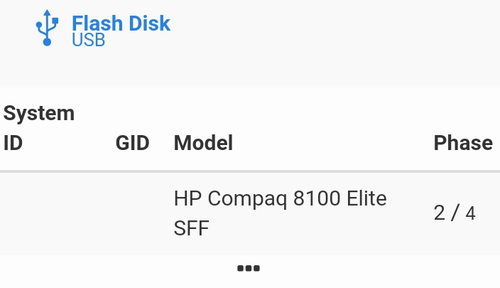
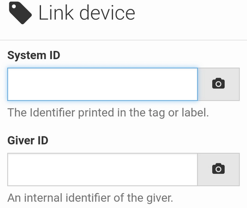
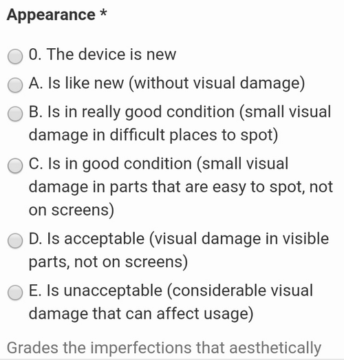
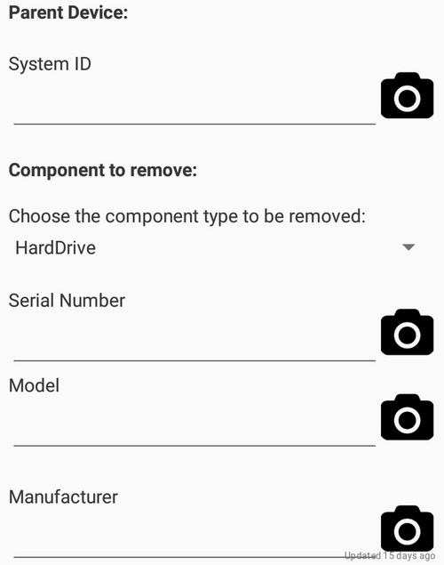
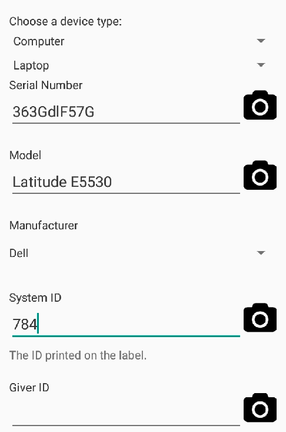
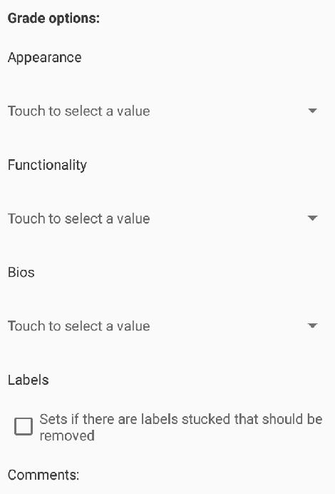
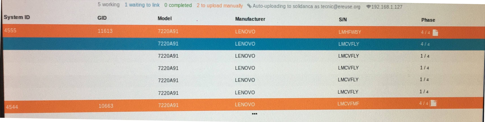
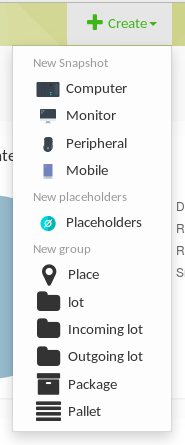
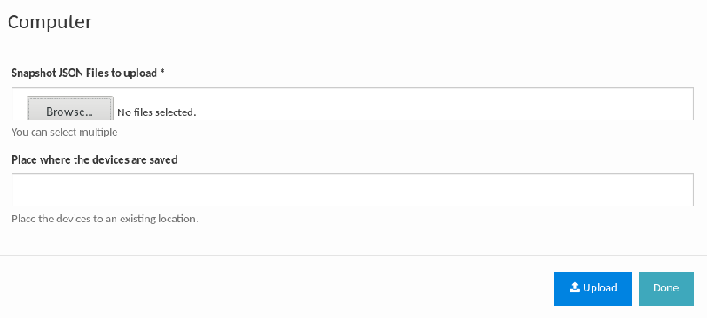

# Introducción de datos del dispositivo

Una vez el proceso ha empezado colocaremos un pendrive USB en un puerto del PC de lo cual queremos subir el _**snapshot**_, será entonces cuando nos aparecerá un icono arriba al cual entraremos.

En esta pantalla colocaremos toda la información que nos pida y daremos a _**submit**_ para terminar el proceso de linkeado. La información se divide en 3 apartados:

* _**Apartado de las ID**_

* _**Apartado de la apariencia**_

* _**Apartado de la funcionalidad**_

Una vez acabado tendremos el pendrive USB desvinculado de la otra maquina y listo para poder usarse cuando sea necesario. Al colocarlo en otro PC el workbench lo sincronizara para añadirlo sin ningún problema. Repetiremos estos pasos para todos los PC que tengamos haciendo el proceso.

**Remove Component**

* Cuando tengamos que quitar algún componente del PC como, por ejemplo, su disco duro, entraremos en esta sección. Esta opción se debería hacer una vez el PC ya ha sido linkeado y lo que debemos hacer es rellenar los campos con la información correspondiente.

**Snapshot a Device**

Si hay alguna maquina que no puede pasar el proceso del _Workbench_ no podrá subirse a la base de datos automáticamente, es entonces cuando usaremos esta opción, la cual ará que podamos subir de manera manual el PC que causa los problemas.

Como en los demás apartados, deberemos colocar la información correspondiente en cada apartado.

Una vez rellenados los campos pasaremos a repetir el proceso con el resto de maquinas.

## Subir PC Manualmente

Si ocurre que al finalizar el _Workbench_ nuestra maquina a quedado en Naranja y no se a subido de forma automática aún podremos subirla de forma manual. Cuando una maquina pasa el proceso creará un archivo **.json** los cuales los podremos encontrar en la carpeta **Workbench .**

Una vez localizado nos dirigiremos a la pagina de nuestro Devicetag e iremos a la opción **Computer** ubicada en **Create.**

Una vez dentro seleccionaremos el **.json** que nos interesa \(pueden ser varios a la vez\) y completaremos el resto de información necesaria.

