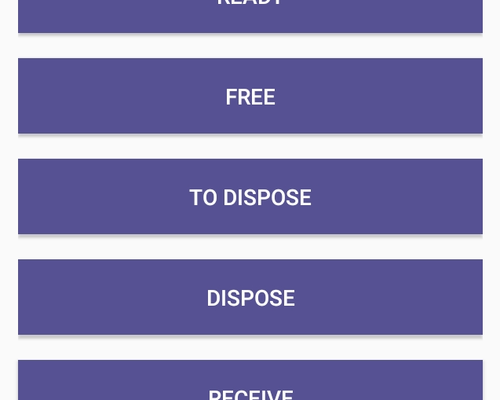

# Event dispose

Empezaremos por **Device Event**.

En esta amplia lista la opción que más daremos uso es la del apartado de **Dispose**. En este apartado añadiremos la ID del producto para moverlo a una lista de material para reciclar. Haremos esto si el ordenador o el periférico no tiene salvación alguna.

