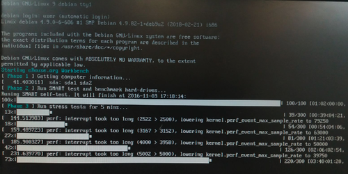

# Fases del Workbench

Cuando el _**Workbench**_ procesa una maquina, este ejecuta fases:  
  
**Fase 1 Cogiendo información del dispositivo**  
  
En este proceso se recopila información detallada de hardware a nivel de componente para añadir dicha información a la base de datos.  
  
**Fase 2 Ejecutar SMART test**  
  
Acabado el anterior paso, el programa ejecutará un test que comprobará el estado y la vida útil del disco duro.  
  
**Fase 3**  
  
En esta parte del proceso se ejecutara un test de estrés, con el cual se podrá comprobar si la maquina posee algún componente el cual falle.  
  
**Fase 4**  
  
En esta ultima fase es cuando se ejecuta el formateo del disco duro \(si así se ha elegido\) y la instalación del sistema operativo escogido. Una vez acabado todo esto nos mostrara el tiempo necesitado y nos comunicara si todo ha ido correcto. Apagamos del botón \(nunca quitar el cable de corriente\) y ya tendremos la maquina lista.

