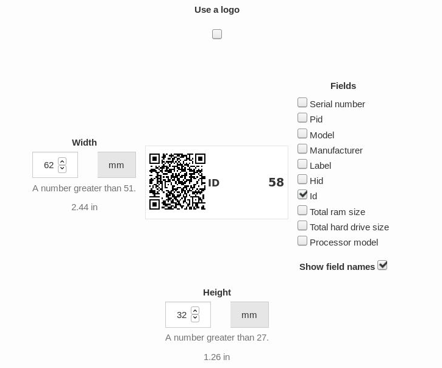
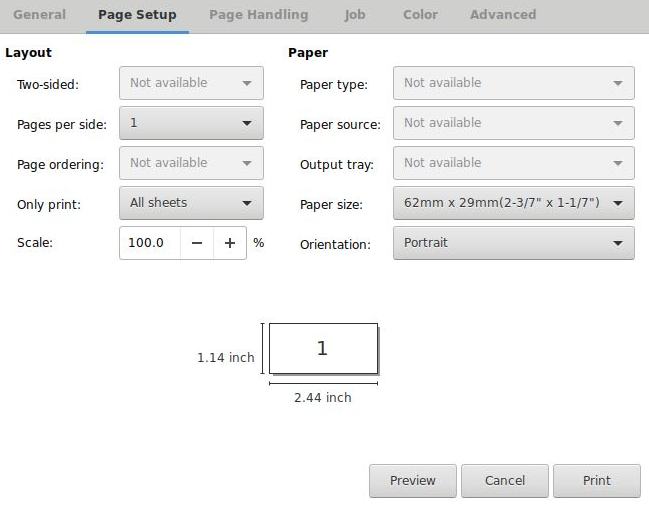
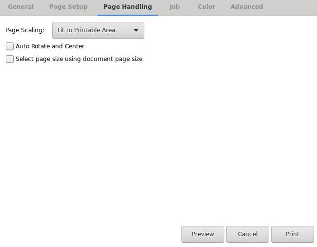

# Configuración de la impresora

En este apartado Configuraremos los tamaños de la etiqueta y los parámetros necesarios de la impresora para una correcta impresión.

**IMPORTANTE** _**Hay que seguir al pie de la letra los parámetros explicados a continuación ya que si no es muy posible que la impresora no imprima correctamente las ID**_

Una vez entrado al apartado **Label** veremos las opciones para la etiqueta. Quitamos las opciones de **Logo** y **Label** dejando únicamente **ID** y **Show field name**. Los tamaños ideales son **Width 62 Height 32**

Una vez descargadas en PDF será la hora de imprimirlas. Es **NECESARIO** que todos los parámetros de impresión coincidan con los mostrados en las 2 siguientes imágenes.

Una vez imprimidas es recomendable poner las etiquetas en un lugar fácilmente visible para poder escanear el código QR.

