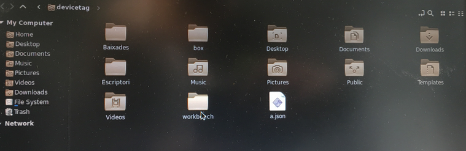
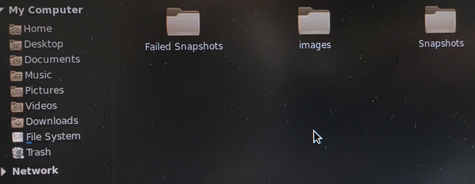

# Carpetas workbench

### Carpeta workbench

1. La carpeta Workbench, se suele encontrar en /**home/{usuario}/workbench**

 2. Dentro del directorio Workbench, hay 3 capetas visibles y una oculta que son:

**Failed snapshots:** Es donde se guardan los archivos .json de los ordenadores que han fallado a la hora de enlazarlos. [Como subir dispositivo manualmente](../enlazar-dispositivo.md)

**Images:** En esta carpeta se encuentran las imágenes .fsa.  [¿Que es una FSA?](configuracion-avanzada/guia-creacion-imagenes-fsa.md)

**Snapshots:** Aquí es donde se encuentra las copias de seguridad del Workbench.

**.settings:** En esta carpeta se meten las actualizaciones del workbench. Está carpeta esta oculta, para poder visualizarla, tenemos que entrar en la carpeta workbench y presionar las teclas **control + h**

### 

