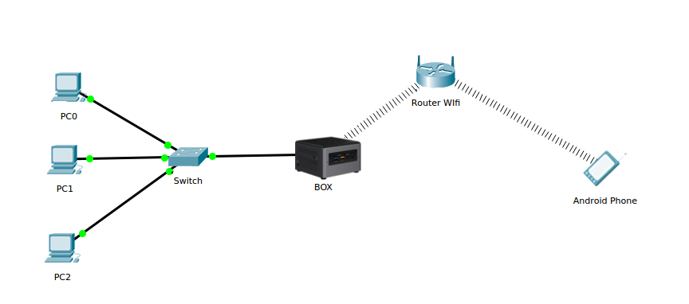

# Lista de materiales

## BOX \(Workbench Server\)

1. ​[BOX](https://www.amazon.es/gp/product/B01MSZTD8N/ref=oh_aui_detailpage_o00_s00?ie=UTF8&psc=1). És un Intel NUC \(ordenador mini, sin RAM ni disco duro\).​
2. ​[RAM](https://www.amazon.es/gp/product/B00CQ35GYE/ref=oh_aui_detailpage_o01_s00?ie=UTF8&psc=1). El mínimo aceptable son 4 GB, aunque recomendamos 8 GB.
3. ​[Disco duro interno](https://www.amazon.es/gp/product/B01N6JQS8C/ref=oh_aui_detailpage_o01_s00?ie=UTF8&psc=1). Cualquier disco duro interno de portátil con más de 60GB serviría. Aunque recomendamos adquirir un SSD para una mejor velocidad del sistema en general y así también una mejor experiencia de uso.
4. Impresora de etiquetas. Nosotros usamos y damos soporte a la [Brother QL-700](https://www.amazon.es/gp/product/B0083WHWGM/ref=oh_aui_detailpage_o02_s00?ie=UTF8&psc=1). Con la cinta/papel [DK2113](https://www.brother-usa.com/products/DK2113).
5. ​[Switch](https://www.amazon.es/gp/product/B00CUG8ESM/ref=oh_aui_detailpage_o05_s00?ie=UTF8&psc=1). Nosotros usamos este [Switch](https://www.amazon.es/gp/product/B00CUG8ESM/ref=oh_aui_detailpage_o05_s00?ie=UTF8&psc=1) en concreto que nos funciona muy bien. \(Recomendado mínimo 1 puerto de GB\) En caso de tener poca cantidad de dispositivos a registrar se puede usar un [Switch](https://www.amazon.es/gp/product/B000BCC0LO/ref=oh_aui_detailpage_o04_s01?ie=UTF8&psc=1) con menos puertos.
6. Varios cables de Ethernet \(mínimo 1 que sea Cat5e o superior\). Con tener el mismo numero de cables que puertos tenga el switch que uséis es suficiente.
7. Un móvil Android \([eReuse.org](http://eReuse.org) APP\). Su uso es para registrar dispositivos que no arrancan o no son compatibles con el Workbench aún.
8. Por ultimo cosas básicas como una pantalla \(monitor\), un teclado y ratón tanto para usar la BOX como para acceder a al BIOS de los equipos para cambiar el arranque por red \(PXE\). También una memoria usb o pendrive \(no genérico\).

###                                            Tabla de materiales 

* **Mínimo Comprometido**: Mínimos estrictos que sacrifican la funcionalidad no esencial que resulta en menor rendimiento o incapacidad para realizar tareas adicionales.
* **Mínimo:** Mínimo para usar toda la funcionalidad al procesar menos de 5 máquinas a la vez.
* **Recomendado**: Buenos valores al procesar hasta 20 maquinas a la vez.
* **Alto Rendimiento**: valores recomendados al procesar más de 20 maquinas a la vez \(probado con 60 máquinas a la vez\).

**1**. Con velocidades de Ethernet de solo 100Mbps desde el ordenador hasta el switch notará que el proceso se ralentiza después de conectar más de 5 equipos y no es recomendable provar con más de 10. Actualice la infraestructura al menos a _Recomendado_ para un uso optimo.

**2**. No podrá usar la aplicación de Android sin una conexión WiFi ya que la aplicación de Android debe conectarse a la Box. La Box requerirá una conexión a Internet para cargar automáticamente el resultado del Workbench al DeviceHub.

3. Los cables de Ethernet en estado no óptimo pueden desconectar instantáneamente la conexión, lo que obliga a reiniciar el proceso para las máquinas afectadas.

\[ENG\] [https://ereuse-org.gitbook.io/faq/which-are-the-system-requirements-to-use-workbench-server](https://ereuse-org.gitbook.io/faq/which-are-the-system-requirements-to-use-workbench-server) 

