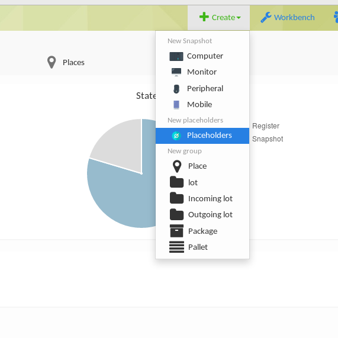
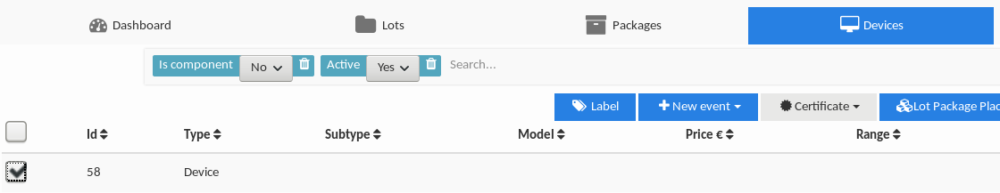

# Crear placeholders

### Que és un placeholder?

Es un dispositivo vació que generamos para luego meter información de un dispositivo.  
Cuando creamos un palceholder se nos genera un id. Con esa id es con la que podemos enlazado un dispositivo. Una vez hemos enlazado un dispositivo con esa id, si nos vamos al dispositivo vacío que hemos creado previamente nos encontraremos la información del dispositivo enlazado.

### Como se crean?

Para poder crear la ID con la cual identificaremos nuestro dispositivo nos dirigiremos al apartado _**+ Create**_ en la esquina superior derecha y en el desplegable elegiremos la opción _**Placeholders**_

Elegiremos la cantidad de _Placeholders_ \(o _etiquetas_\) que necesitamos y las crearemos dándole a **Submit**.

Una vez creadas las ID aparecerán en el apartado **Devices**. El siguiente paso es seleccionar las recién creadas e irnos a **Label** para empezar con el proceso de imprimirlas.

