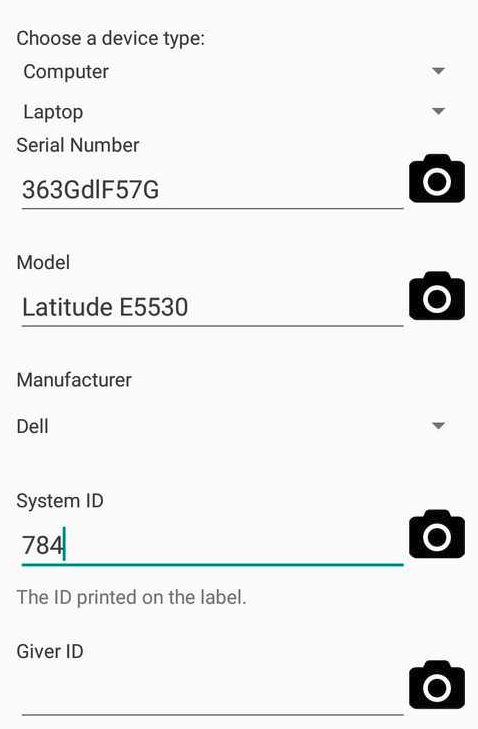
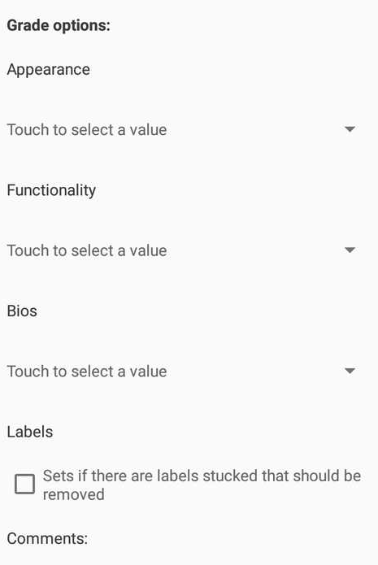
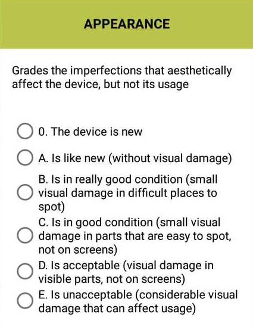
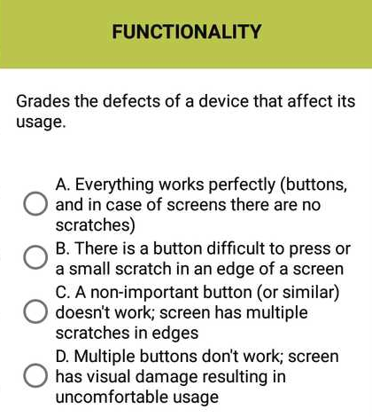
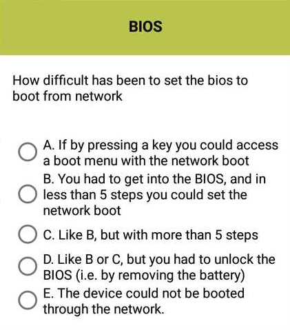
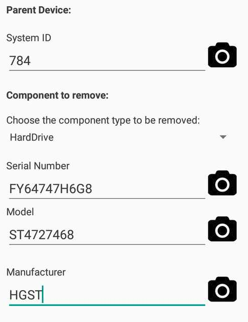

# Reutilizar un componente de un dispositivo defectuoso

Si una maquina no consigue arrancar y queremos aprovechar sus componentes como, por ejemplo, el HDD, se etiqueta el dispositivo mediante la etiqueta con su ID correspondiente y se sube la información con la app mediante la opción de 

**Snapshot a Device**

 En el apartado de 

_**Giver ID**_

Vamos a poner la información relativa al donante en caso de que disponga una etiqueta con el ID de la entidad que ha realizado la donación. 

 En este apartado elegiremos una puntuación a 3 factores importantes.

* La **Apariencia**, por si tiene daños visibles.

* **La Funcionalidad**, por si algunos de sus botones no funcionan correctamente

* La **Bios**, para comentar si es fácil o difícil tratar con ella.

Una vez tengamos nuestra maquina registrada, quitaremos la parte que queremos reutilizar \(en este caso el HDD\) e iremos al apartado 

**Remove Component**

 y rellenaremos todos los campos necesarios. 

